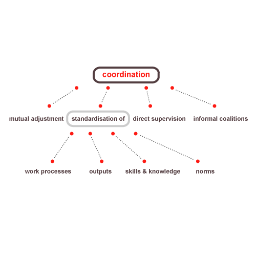

# Mintzberg

Source: https://web.archive.org/web/20081120142706/http://www.provenmodels.com/17/pdf

## Original artilce:

The Canadian academic, Henry Mintzberg, distinguished six coordination mechanisms from organisational design literature. Any group of individuals that needs to accomplish a complex task faces two opposing requirements: the division of labour of the task into subtasks to support specialisation, and the coordination of these subtasks to accomplish the overall task. Mintzberg defined organisational structure as 'the sum total of the ways in which its divides its labour into distinct tasks and then achieves coordination among them'.

The six coordination mechanisms are:

1. Mutual adjustment
Coordination of work is made possible by a process of informal communication between people conducting interdependent work.

2. Direct supervision 
Coordination is achieved by one individual taking responsibility for the work of others.

3. Standardization of work processes
Coordination is made possible by specifying the work content in rules or routines to be followed. Coordination occurs before the activity is undertaken. Mintzberg adopted Taylorism: procedures are usually specified by work-study analysis.

4. Standardization of output
Coordination is obtained by the communication and clarification of expected results. The individual actions required to obtain a goal are not prescribed. This goal setting method is closely related to Drucker's Management by Objectives.

5. Standardization of skills and knowledge
Coordination is reached through specified and standardised training and education. People are trained to know what to expect of each other and coordinate in almost automatic fashion.

6. Standardisation of norms
Norms are standardized, socialization is used to establish common values and beliefs in order for people work toward common expectations. Mintzberg added this cultural based mechanism at a later stage.

In political organisations, fractions form temporary coalitions to achieve their sub-goals. Mintzberg did not categorise these activities as a specific coordination mechanism.

## Model
